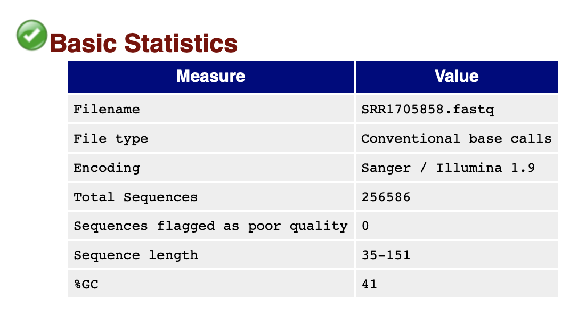

# Project #2. “I got vaccinated; why did I get the flu?!”

**Day 1. 15.11.2020**

## 1. Inspect the data from roommate

Download roommate’s data (SRR1705851)

`wget ftp://ftp.sra.ebi.ac.uk/vol1/fastq/SRR170/001/SRR1705851/SRR1705851.fastq.gz`

Unzip

`gzip -d SRR1705851.fastq.gz`

## 2. Align roommate’s data to the reference sequence

### 2.1. Download reference sequence for the influenza hemagglutinin gene

We download reference sequence from: `https://www.ncbi.nlm.nih.gov/nuccore/KF848938.1?report=fasta`

We save it to the `reference.fasta` file.

### 2.2. Index the reference file

`bwa index reference.fasta`

### 2.3. Align viral data, create, sort and index bam file

`bwa mem reference.fasta SRR1705851.fastq > alignment.sam`

`samtools view -S -b alignment.sam > alignment.bam`

`samtools sort alignment.bam -o roommate.bam`

`samtools index roommate.bam`

## 3. Look for common variants with VarScan

### 3.1. Create mpileup

Now we will find max depth

`samtools depth -d 0 roommate.bam | cut -f3 | sort -n | tail -1`

Output:

`44522`

Create mpileup, we will use -d parameter 45000, because now we know that it's higher than our coverage

`samtools mpileup -d 45000 -f reference.fasta roommate.bam > my.mpileup`

### 3.2. Call VarScan

Now we will find mutants present in most (95% or more) of the viral DNA molecules

`java -jar ../VarScan.v2.4.4.jar  mpileup2snp my.mpileup --min-var-freq 0.95 --variants --output-vcf 1 > VarScan_results.vcf`

Output:

```
5 variant positions (5 SNP, 0 indel)
0 were failed by the strand-filter
5 variant positions reported (5 SNP, 0 indel)
```

Positions of SNPs

`cat VarScan_results.vcf|awk 'NR>24 {print $1, $2, $4, $5}'`

Output:

```
KF848938.1 72 A G
KF848938.1 117 C T
KF848938.1 774 T C
KF848938.1 999 C T
KF848938.1 1260 A C
```

So, we find 5 SNPs

We look at SNPs in IGV browser:

1. ACA (T) → ACG (T) no effect
2. GCC (A) → GCT (A) no effect
3. TTT (F) → TTC (F) no effect
4. GGC (G) → GGT (G) no effect
5. CTA (L) → CTC (L) no effect

All of them have no effect on protein

## 4. Look for rare variants with VarScan

Now we set minimum variant frequency to 0.1%:

`java -jar ../VarScan.v2.4.4.jar  mpileup2snp my.mpileup --min-var-freq 0.001 --variants --output-vcf 1 > VarScan_results_rare.vcf`

Output:

```
23 variant positions (21 SNP, 2 indel)
0 were failed by the strand-filter
21 variant positions reported (21 SNP, 0 indel)
```

We find 21 SNPs.

Now let's look at their frequency: 

`cat VarScan_results_rare.vcf | awk 'NR>24 {split($10,a,":"); print $1, $2, $4, $5, a[7]}'`

Output:

```
KF848938.1 72 A G 99,96%
KF848938.1 117 C T 99,82%
KF848938.1 254 A G 0,17%
KF848938.1 276 A G 0,17%
KF848938.1 307 C T 0,94%
KF848938.1 340 T C 0,17%
KF848938.1 389 T C 0,22%
KF848938.1 691 A G 0,17%
KF848938.1 722 A G 0,2%
KF848938.1 744 A G 0,17%
KF848938.1 774 T C 99,96%
KF848938.1 802 A G 0,23%
KF848938.1 859 A G 0,18%
KF848938.1 915 T C 0,19%
KF848938.1 999 C T 99,86%
KF848938.1 1043 A G 0,18%
KF848938.1 1086 A G 0,21%
KF848938.1 1213 A G 0,22%
KF848938.1 1260 A C 99,94%
KF848938.1 1280 T C 0,18%
KF848938.1 1458 T C 0,84%
```

So we have some rare mutations, but now we will inspect and align the control samples to remove errors

## 5. Inspect and align the control sample sequencing data

### 5.1. Download and unzip files

Download:

SRR1705858: 
`wget ftp://ftp.sra.ebi.ac.uk/vol1/fastq/SRR170/008/SRR1705858/SRR1705858.fastq.gz`

SRR1705859: 
`wget ftp://ftp.sra.ebi.ac.uk/vol1/fastq/SRR170/009/SRR1705859/SRR1705859.fastq.gz`

SRR1705860: 
`wget ftp://ftp.sra.ebi.ac.uk/vol1/fastq/SRR170/000/SRR1705860/SRR1705860.fastq.gz`

Unzip

```
gzip -d SRR1705858.fastq.gz
gzip -d SRR1705859.fastq.gz
gzip -d SRR1705860.fastq.gz
```

### 5.2. Look at reads

Calculare number of reads:


```
wc -l SRR1705858.fastq
wc -l SRR1705859.fastq
wc -l SRR1705860.fastq
```

Output:

```
1026344 SRR1705858.fastq
  933308 SRR1705859.fastq
  999856 SRR1705860.fastq
```

So we have: 1026344 / 4 = 256586, 933308 / 4 = 233327, 999856 / 4 = 249964 number of reads for each file.

We will also generate fastqc reports to look at some basic statistics:

`fastqc -o . SRR1705858.fastq SRR1705859.fastq SRR1705860.fastq`

Result:



### 5.3. Estimation of the coverage

Gene sequence length is 1665. Number of contigs is about 257000, length is in the range 35-151. For estimation we will use 151. We can estimate coverage: 257000 / (1665 / 151) ~ 23308. 

In the next paragraph we will find actual max and average coverage for each control.

### 5.4. Align control data, create, sort and index bam files

```
bwa mem reference.fasta SRR1705858.fastq > alignment_1.sam
bwa mem reference.fasta SRR1705859.fastq > alignment_2.sam
bwa mem reference.fasta SRR1705860.fastq > alignment_3.sam
```

```
samtools view -S -b alignment_1.sam > alignment_1.bam
samtools view -S -b alignment_2.sam > alignment_2.bam
samtools view -S -b alignment_3.sam > alignment_3.bam
```

```
samtools sort alignment_1.bam -o alignment_1_sort.bam
samtools sort alignment_2.bam -o alignment_2_sort.bam 
samtools sort alignment_3.bam -o alignment_3_sort.bam 
```

```
samtools index alignment_1_sort.bam
samtools index alignment_2_sort.bam 
samtools index alignment_3_sort.bam
```

Let's look at max depth:

```
samtools depth -d 0 alignment_1_sort.bam | cut -f3 | sort -n | tail -1
samtools depth -d 0 alignment_2_sort.bam | cut -f3 | sort -n | tail -1
samtools depth -d 0 alignment_3_sort.bam | cut -f3 | sort -n | tail -1
```

Output:

```
35782
32837
36262
```

And at average depth and coverage:

For 1st:

`samtools coverage alignment_1_sort.bam`

Output:

```
#rname	startpos	endpos	numreads	covbases coverage meandepth meanbaseq meanmapq
KF848938.1	1	1665	256658	1665	100	22630.8 36.6 60
```

For 2nd:

`samtools coverage alignment_2_sort.bam`

Output:

```
#rname	startpos	endpos	numreads	covbases coverage meandepth meanbaseq meanmapq
KF848938.1	1	1665	233375	1665	100	20565.5 36.5 60
```

For 3rd:

`samtools coverage alignment_3_sort.bam`

Output:

```
#rname	startpos	endpos	numreads	covbases coverage meandepth meanbaseq meanmapq
KF848938.1	1	1665	250108	1665	100	22048.1 36.6 60
```

We can see, that we have pretty good estimation of average coverage in previous paragraph.

### 5.5. Create mpileup

Create mpileup, we will use -d parameter 37000, because now we know that it's higher than our coverage

```
samtools mpileup -d 37000 -f reference.fasta alignment_1_sort.bam > alignment_1_sort.mpileup
samtools mpileup -d 37000 -f reference.fasta alignment_2_sort.bam > alignment_2_sort.mpileup
samtools mpileup -d 37000 -f reference.fasta alignment_3_sort.bam > alignment_3_sort.mpileup
```

## 6. Use VarScan to look for rare variants in the reference files

Now we run VarScan with a minimum variant frequency of 0.1% on each of the reference
alignments:

`java -jar ../VarScan.v2.4.4.jar  mpileup2snp alignment_1_sort.mpileup --min-var-freq 0.001 --variants --output-vcf 1 > VarScan_results_alignment_1.vcf`

`java -jar ../VarScan.v2.4.4.jar  mpileup2snp alignment_2_sort.mpileup --min-var-freq 0.001 --variants --output-vcf 1 > VarScan_results_alignment_2.vcf`

`java -jar ../VarScan.v2.4.4.jar  mpileup2snp alignment_3_sort.mpileup --min-var-freq 0.001 --variants --output-vcf 1 > VarScan_results_alignment_3.vcf`

And now create lists containing SNPs the reference base, position, alternative base, and frequency. Write it to csv:

`cat VarScan_results_alignment_1.vcf | awk 'FNR==1 {print "position,reference_base,alternative_base,frequency";next} NR>24 {gsub(",", ".", $10); split($10,a,":"); print $2, $4, $5, a[7]}' OFS=, > Lab\ notebooks/project2_flu_scripts/raw_data/VarScan_results_alignment_1.csv`

`cat VarScan_results_alignment_2.vcf | awk 'FNR==1 {print "position,reference_base,alternative_base,frequency";next} NR>24 {gsub(",", ".", $10); split($10,a,":"); print $2, $4, $5, a[7]}' OFS=, > Lab\ notebooks/project2_flu_scripts/raw_data/VarScan_results_alignment_2.csv`

`cat VarScan_results_alignment_3.vcf | awk 'FNR==1 {print "position,reference_base,alternative_base,frequency";next} NR>24 {gsub(",", ".", $10); split($10,a,":"); print $2, $4, $5, a[7]}' OFS=, > Lab\ notebooks/project2_flu_scripts/raw_data/VarScan_results_alignment_3.csv`

And also for roommate's data:

`cat VarScan_results_rare.vcf | awk 'FNR==1 {print "position,reference_base,alternative_base,frequency";next} NR>24 {gsub(",", ".", $10); split($10,a,":"); print $2, $4, $5, a[7]}' OFS=, > Lab\ notebooks/project2_flu_scripts/raw_data/VarScan_results_roommate.csv`

Results are available by [link](https://github.com/NikKonst/project2_flu/tree/master/project2_flu_scripts/raw_data).

## 7.-8. Compare the control results to your roommate’s results and Epitope mapping

All of the following steps are done in `project2.ipynb` and are available by [link](https://github.com/NikKonst/project2_flu/tree/master/project2_flu_scripts/project2.ipynb).

